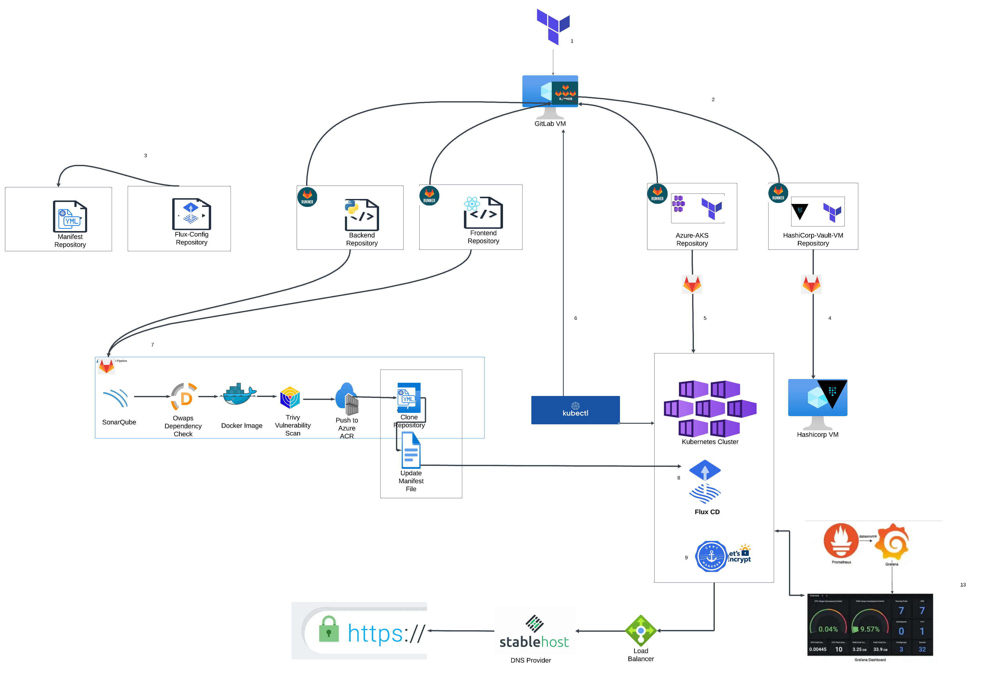
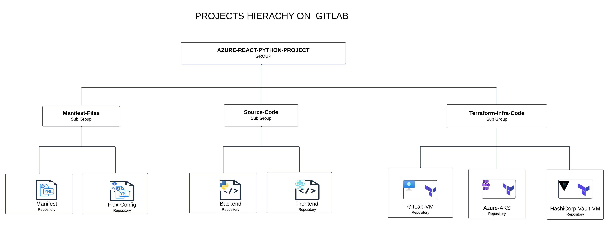

## Project Overview: Azure DevOps with Kubernetes Deployment


### Introduction
Welcome to the Azure DevOps with Kubernetes Deployment project! This repository contains the infrastructure code, Kubernetes manifests, and application source code required to build a reliable DevOps pipeline and deploy applications to a Kubernetes cluster hosted on Azure.

### Overview
Our project simplifies the deployment process by integrating key tools and technologies:

- **Terraform** for infrastructure provisioning,
- **GitLab CI/CD** for automated pipelines,
- **HashiCorp Vault** for secure secrets management, and
- **Kubernetes** for container orchestration.

With the resources and guidance provided, you can set up a fully automated CI/CD pipeline and effortlessly deploy applications to a Kubernetes cluster.

### Directory Structure

#### Terraform-code-infra
- **Azure-aks**: Terraform scripts for provisioning an Azure AKS cluster.
- **Gitlab-vm**: Terraform scripts for creating a GitLab VM on Azure.
- **Hashicorp-vault-vm**: Terraform scripts for creating a GitLab VM on Azure.

#### Kubernetes-Manifests
- **Flux-config**: Configuration files for FluxCD, enabling GitOps practices.
- **Manifests**: 
    - **Backend**: Kubernetes manifests for backend application deployment.
    - **Database**: Kubernetes manifests for database deployment (e.g., stateful sets, services) 
    - **Frontend**: Kubernetes manifests for frontend application deployment.

#### Terraform-code-infra
- **Backend**: Source code and Dockerfile for the backend application.
- **Frontend**: Source code and Dockerfile for the frontend application.

## Getting Started
    ```bash
    ### Note
    I will provide detailed step-by-step instructions and explanations ASAP. Thank you for your understanding and patience!
  

## Conclusion
This project aims to simplify deployment and elevate DevOps practices by utilizing modern cloud technologies and industry best practices. With the provided resources and step-by-step guidance, you can accelerate your application deployment process while ensuring a reliable and scalable infrastructure.

## License
This project is licensed under the MIT License. See the [LICENSE](LICENSE) file for more information.